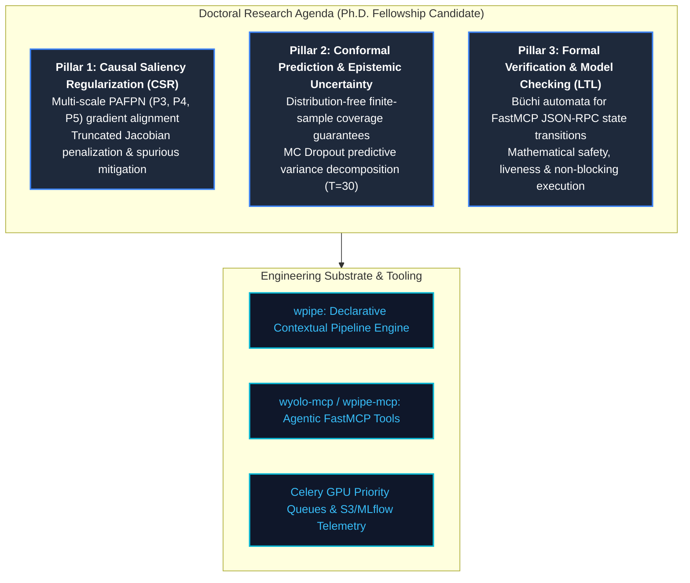

<div align="center">

# 🌐 William Rodriguez (wisrovi) — Academic & Systems Engineering Portfolio

[](https://nextjs.org/)
[](https://react.dev/)
[](https://www.typescriptlang.org/)
[](https://tailwindcss.com/)
[](https://orcid.org/0009-0005-0710-1861)
[](https://pypi.org/user/wisrovi/)
[](LICENSE)

<p align="center">
  <strong>Interactive Research & Engineering Portfolio of William Steve Rodriguez Villamizar</strong><br>
  Principal Software Engineer, AI Solutions Architect & Ph.D. Fellowship Candidate.<br>
  <em>Bridging Formal Verification (LTL), Explainable Computer Vision (XAI), and Enterprise Distributed MLOps.</em>
</p>

[Live Production Portal](https://wisrovi.dev) • [ORCID Record](https://orcid.org/0009-0005-0710-1861) • [PyPI Profile](https://pypi.org/user/wisrovi/) • [LinkedIn](https://www.linkedin.com/in/wisrovi-rodriguez/)

</div>

---

## 🏛️ Executive Overview

This web portal is an advanced, gamified, and responsive Next.js application presenting the complete scientific output, open-source infrastructure portfolio, and doctoral research credentials of **William Rodriguez (wisrovi)**.

It serves as a hybrid showcase combining rigorous engineering systems with high-impact academic output targeted at international doctoral research committees (Computer Science / Artificial Intelligence):

1. **Academic Output & Preprints:** 26 scientific preprints registered with official CERN/Zenodo DOIs covering quantitative XAI, adversarial robustness, formal verification (LTL/MCP), and autonomous MLOps.
2. **Open-Source Ecosystem:** 23 actively maintained, published PyPI packages (37 total modular repositories) encompassing FastMCP servers, reactive message brokers, database drivers, and CLI developer tooling (`w-cli`).
3. **Flagship Distributed Platform:** **NeuralForge AI (wyoloservice2)**, an enterprise-grade distributed Computer Vision platform orchestrating multi-GPU sweeps with Optuna TPESampler, isolated Docker workers, and a 22-step post-train forensic pipeline.

---

## 🧠 Core Doctoral Research Pillars



---

## 📦 Software & PyPI Catalog (23 Published Packages)

The author has engineered, tested, and published 23 independent packages on PyPI under the `wisrovi` namespace:

| Category | Published PyPI Packages | Core Engineering Highlights |
| :--- | :--- | :--- |
| **Agentic AI & Pipelines** | `wpipe`, `wagents` | Declarative execution engine, context-dependent step injection, multi-agent orchestration |
| **Model Context Protocol** | `wpipe-mcp`, `wyoloservice-mcp`, `wredis-mcp`, `wmongo-mcp`, `wpostgres-mcp`, `wkafka-mcp`, `wminio-mcp` | FastMCP servers bridging LLM agents with production datastores and training clusters via JSON-RPC |
| **Distributed Messaging** | `wkafka`, `wrabbitmq` | Zero-boilerplate decorators, Avro/JSON serialization, resilient auto-reconnect |
| **Database Persistence** | `wredis`, `wmongo`, `wpostgresql`, `wsqlite` | Thread-safe connection pooling, schema validations, robust CRUD abstractions |
| **Object Storage** | `wminio` | S3-compatible asset management, pre-signed URLs, stream uploads |
| **DevOps & Infrastructure**| `wcontainer`, `wportforward`, `wsecurity`, `wmail`, `wlogger` | Docker SDK management, dynamic port forwarding, cryptographic hashing, logging |
| **Developer Command Center**| `w-cli` | Unified interactive Rich TUI CLI to initialize, scaffold, and manage the full ecosystem |

---

## 🚀 Key Application Features

- **Responsive & Themed UI:** Built with React 19, Next.js 15, and Tailwind CSS with instant light/dark mode switching.
- **Bilingual Internationalization:** Complete Spanish and English content support (`LanguageSelector.tsx`).
- **Interactive Gamification:** Interactive world map (`GameWorld.tsx`) and skill exploration tree (`TalentExplorer.tsx`).
- **Autonomous Assistant:** Integrated AI chatbot (`VirtualAssistant.tsx`) contextualized on author publications and projects.
- **ATS-Optimized Printable CV:** Dedicated, printable CV view (`PrintableCV.tsx`) formatted for academic and enterprise evaluation committees.

---

## 🛠️ Local Development & Setup

### Prerequisites
- Node.js 18.x or 20.x
- npm 9.x or higher

### Installation
```bash
# 1. Clone the repository
git clone https://github.com/wisrovi/portfolio-wisrovi.git
cd portfolio-wisrovi

# 2. Install dependencies
npm install

# 3. Start local development server
npm run dev
```

Visit [http://localhost:3000](http://localhost:3000) in your browser.

### Production Build
```bash
npm run build
npm run start
```

---

## 📂 Repository Structure

```
portfolio-wisrovi/
├── public/                 # Static assets, badges, and icons
├── src/
│   ├── app/                # Next.js App Router
│   │   ├── about/          # Academic bio, doctoral pillars, and degrees
│   │   ├── contact/        # Verified contact channels & social links
│   │   ├── cv/             # Formal ATS-compliant CV layout
│   │   ├── experience/     # Senior industry leadership & systems track record
│   │   ├── libraries/      # Interactive 23-PyPI package catalog with tabs & search
│   │   ├── projects/       # NeuralForgeAI, FastMCP suite, and 26 Preprints
│   │   └── page.tsx        # Modern Hero portal & doctoral announcement
│   ├── components/         # Reusable UI, GameWorld, PrintableCV, LanguageSelector
│   └── styles/             # Tailwind utility extensions and animations
├── next.config.ts          # Next.js configuration
├── package.json            # Project dependencies and build scripts
└── README.md               # English project documentation
```

---

## 👤 Official Author Profile

- **Author:** William Steve Rodriguez Villamizar (wisrovi)
- **Roles:** Principal Software Engineer, AI Solutions Architect & Ph.D. Fellowship Candidate
- **Affiliation:** wisrovi-suit AI Research Initiative, Badajoz, Spain
- **Degrees:**
  - M.Sc. in Artificial Intelligence — *Valencian International University (VIU), Spain* (2024–2025)
  - B.Sc. in Electronic Engineering (*Magna cum laude*) — *Universidad de Investigación y Desarrollo (UDI), Colombia* (2009–2014)
- **ORCID:** [0009-0005-0710-1861](https://orcid.org/0009-0005-0710-1861)
- **PyPI:** [pypi.org/user/wisrovi](https://pypi.org/user/wisrovi/)
- **GitHub:** [github.com/wisrovi](https://github.com/wisrovi)
- **LinkedIn:** [linkedin.com/in/wisrovi-rodriguez](https://www.linkedin.com/in/wisrovi-rodriguez/)

---

## 📄 License

This repository is licensed under the [MIT License](LICENSE).
